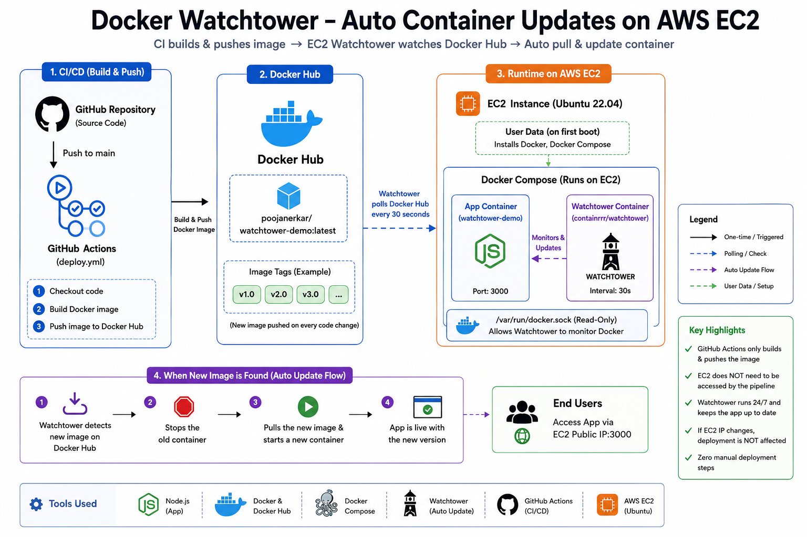
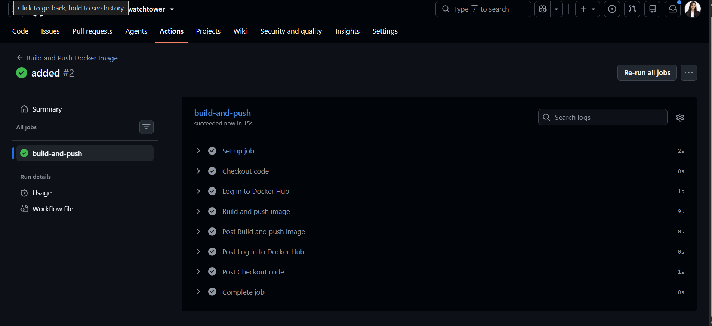
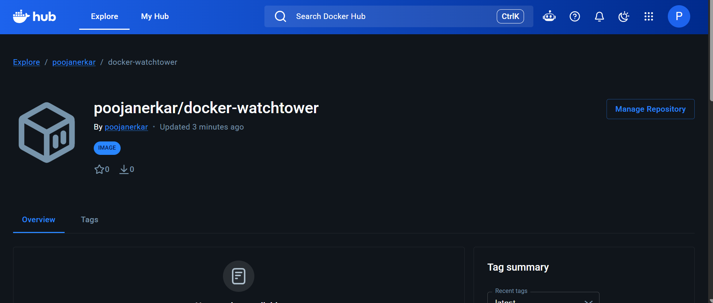
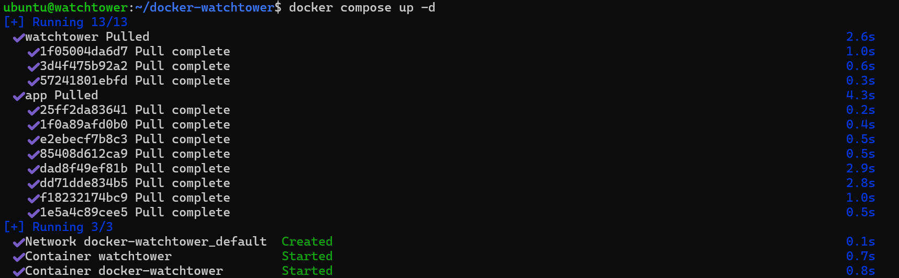
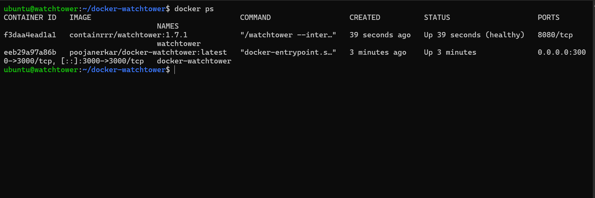
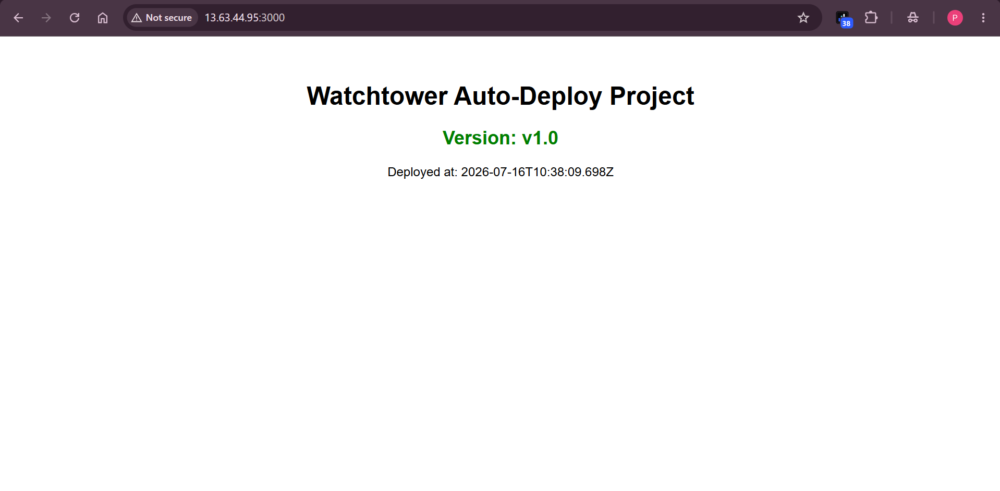
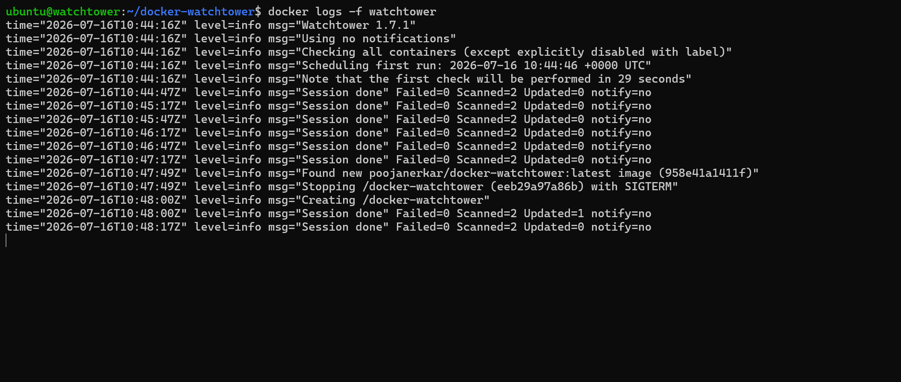
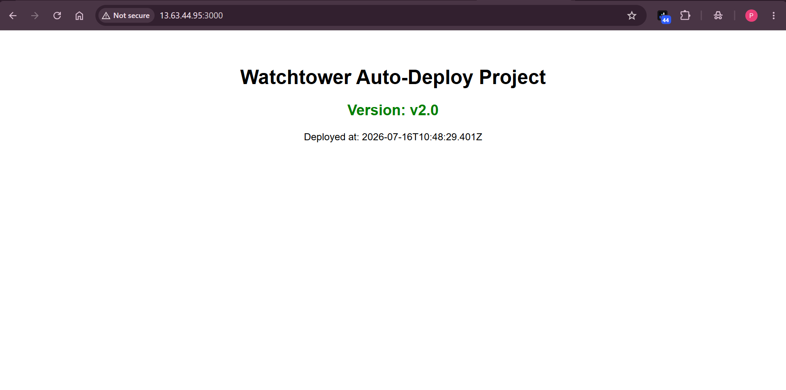
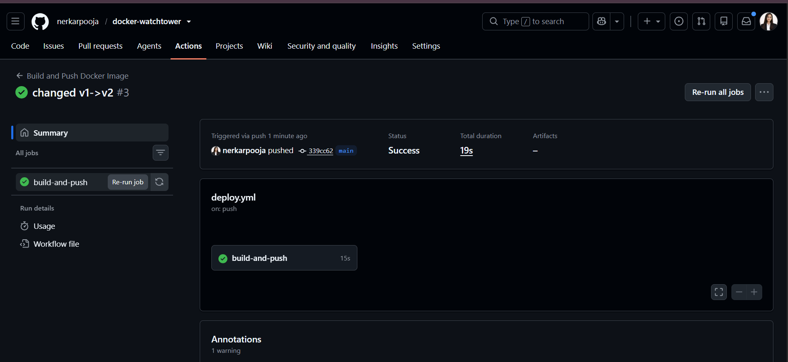

# 🐳 Docker Watchtower — Auto Container Updates on AWS EC2

> What if your server could update itself every time you push code — without you writing a single deployment step?

---

## 💭 Wait — Can't GitHub Actions Just Deploy It?

Yes. Absolutely. GitHub Actions can SSH into EC2, pull the new image, and restart the container. I've done that before in my [Dockerized Blog App CI/CD project](https://github.com/nerkarpooja/my-blog-github-actions).

So why build this?

Because that approach means **your CI/CD pipeline is responsible for deployment**. It needs SSH access to your server. It needs to know your server's IP. If your server IP changes (which it does on EC2 stop/start), your pipeline breaks. You have to update secrets, fix the workflow, redeploy.

**Watchtower flips this completely.**

Instead of your pipeline reaching INTO the server to deploy — the server watches Docker Hub and **pulls updates itself**. Your pipeline only does what CI/CD should do: build and push an image. The server handles the rest, independently.

| | GitHub Actions SSH Deploy | Watchtower Approach |
|---|---|---|
| Pipeline responsibility | Build + Push + Deploy | Build + Push only |
| Server needs SSH exposed | Yes | No |
| Server IP changes break pipeline | Yes | No |
| Deployment logic lives in | .yml file | On the server itself |
| Works even if pipeline changes | No | Yes |
| Best for | Full control, staging/prod | Lightweight, always-on CD |

This isn't "one is better than the other." Both are valid. This project explores a different mental model — **server-pull instead of pipeline-push.**

---

## 🔍 What is Watchtower?

Watchtower is a Docker container that runs alongside your app container on the same server.

Every 30 seconds, it checks Docker Hub:
*"Has the image for any of my running containers been updated?"*

- **New image found** → pulls it, stops the old container, starts a new one with the latest image
- **No change** → does nothing, checks again in 30 seconds

It requires zero changes to your pipeline. No SSH steps. No deployment scripts. No server IPs in your secrets. You just push an image to Docker Hub — and Watchtower does the rest on its own.

> Think of it like a security guard who checks the notice board every 30 seconds.  
> If a new update appears, he acts on it — without you having to call him.

---

## 🏗️ How This Project Works

```
You push code to GitHub
        ↓
GitHub Actions builds a Docker image and pushes it to Docker Hub
        ↓
Watchtower (running on EC2) polls Docker Hub every 30 seconds
        ↓
New image detected → pulls it → restarts app container automatically
        ↓
App is live with new version — no SSH, no manual steps, nothing
```

The pipeline has **one job**: build and push.  
The server has **one job**: stay updated.  
They never need to talk to each other directly.



---

## 🛠️ Tools Used

| Tool | Why |
|---|---|
| **Node.js** | Simple app to demonstrate versioned deployments |
| **Docker + Docker Hub** | Containerizes the app and stores built images |
| **Docker Compose** | Runs app + Watchtower together with a single command |
| **Watchtower** | Monitors Docker Hub and auto-restarts containers on new image |
| **GitHub Actions** | Builds and pushes the Docker image on every push to main |
| **AWS EC2** | Ubuntu server where containers run |
| **EC2 User Data** | Automatically installs Docker on first boot — no manual SSH setup |

---

## 📁 What's in This Repo

```
docker-watchtower/
├── app/
│   └── index.js              ← the Node.js app (shows current version)
├── .github/
│   └── workflows/
│       └── deploy.yml        ← GitHub Actions: builds image, pushes to Docker Hub
├── Dockerfile                ← how to build the app image
├── docker-compose.yml        ← runs app + Watchtower together on EC2
└── .dockerignore
```

Open the files to see exactly how each piece is configured — everything is documented inline.

---

## 🚀 Setup — Step by Step

### Step 1 — Launch EC2 with User Data

Go to **AWS Console → EC2 → Launch Instance** and configure:

- **Name:** `watchtower-demo`
- **AMI:** Ubuntu Server 22.04 LTS
- **Instance type:** t2.micro (free tier eligible)
- **Key pair:** select existing or create new
- **Security group inbound rules:**
  - Port 22 (SSH) — My IP
  - Port 3000 (App) — Anywhere (0.0.0.0/0)

Scroll to **Advanced details → User data** and paste this script:

```bash
#!/bin/bash
exec > /var/log/user-data.log 2>&1

apt update -y
apt install -y docker.io
systemctl start docker
systemctl enable docker
apt install -y docker-compose-v2
usermod -aG docker ubuntu
```

Click **Launch instance**. This script runs automatically on first boot as root — Docker and Docker Compose are installed and ready by the time you SSH in. No manual setup needed. Everything is logged to `/var/log/user-data.log` if you need to debug.


---

### Step 2 — Create a Public GitHub Repository

Go to **github.com → New repository**

- **Name:** `docker-watchtower`
- **Visibility:** Public
- Do NOT check "Add a README" — keep it completely empty

Click **Create repository** and copy the repo URL.

---

### Step 3 — Create Project Files Locally and Push

Clone the empty repo on your local machine, create all the project files — `app/index.js`, `Dockerfile`, `docker-compose.yml`, `.dockerignore`, and `.github/workflows/deploy.yml`. All file contents are available in this repo.

Once all files are created, push to GitHub:

```bash
git add .
git commit -m "initial commit - v1.0"
git push
```

This push will trigger GitHub Actions automatically. It will **fail on first run** because Docker Hub secrets are not added yet — that is expected. Move to Step 4 immediately.

---

### Step 4 — Add Docker Hub Secrets to GitHub

Go to your GitHub repo → **Settings → Secrets and variables → Actions → New repository secret**

Add these two secrets:

| Secret name | Value |
|---|---|
| `DOCKER_USERNAME` | your Docker Hub username |
| `DOCKER_PASSWORD` | your Docker Hub access token (not your password) |

To create a Docker Hub access token: Docker Hub → Account Settings → Security → New Access Token → copy it and paste as `DOCKER_PASSWORD`.

Once both secrets are saved, go to **Actions tab → click the failed run → Re-run all jobs**.

Wait 2-3 minutes. The workflow will go green ✅ — this means your image `poojanerkar/docker-watchtower:latest` is now built and pushed to Docker Hub.





---

### Step 5 — SSH into EC2, Clone Repo, Start Containers

This is the **only manual command sequence in the entire project**. You do this once. Never again.

SSH into your EC2:

```bash
ssh -i your-key.pem ubuntu@<EC2-PUBLIC-IP>
```

Then clone the repo and start everything:

```bash
git clone https://github.com/nerkarpooja/docker-watchtower.git
cd docker-watchtower
docker compose up -d
```

Docker Compose reads `docker-compose.yml` and pulls two images from their registries:
- `poojanerkar/docker-watchtower:latest` — your app (from Docker Hub)
- `containrrr/watchtower:1.7.1` — the Watchtower watcher (from Docker Hub)

Nothing is built on EC2. Both images are pulled and both containers start.



Verify both containers are running:

```bash
docker ps
```

You should see `docker-watchtower` and `watchtower` both with status **Up (healthy)**.



Open your browser at `http://<EC2-PUBLIC-IP>:3000` — the app is live showing **Version: v1.0**.



---

### Step 6 — Push v2.0 and Watch Watchtower Auto-Deploy

This is where Watchtower's job begins. You never touch EC2 again.

On EC2, start watching Watchtower logs live in one terminal:

```bash
docker logs -f watchtower
```

On your **local machine**, open `app/index.js` and change:

```javascript
const VERSION = 'v2.0';
```

Push the change:

```bash
git add .
git commit -m "update to v2.0"
git push
```

GitHub Actions triggers automatically, builds the new image, and pushes it to Docker Hub (~2-3 minutes).

Watchtower checks Docker Hub every 30 seconds. Within 30 seconds of the new image being available, you will see this in the EC2 terminal:

```
Found new poojanerkar/docker-watchtower:latest image
Stopping /docker-watchtower with SIGTERM
Creating /docker-watchtower
Session done — Updated=1
```



Refresh `http://<EC2-PUBLIC-IP>:3000` — now shows **Version: v2.0**. Automatically. Without you touching the server.





---

## 💡 What I Learned From This

The biggest insight wasn't technical — it was architectural.

Most beginners (including me before this) think of deployment as something the **pipeline does**. You write SSH steps in your YAML file, add server credentials to secrets, and the pipeline reaches into the server to deploy.

Watchtower taught me a different way to think about it: **what if the server pulls updates instead of the pipeline pushing them?**

This means:
- Your pipeline stays clean — it only builds and pushes an image
- Your server is self-sufficient — it knows how to update itself
- No SSH credentials in GitHub secrets
- EC2 IP changes don't break anything
- The same docker-compose.yml works on any server without modification

This pattern is closer to how GitOps works — where the desired state is defined in a registry, and the infrastructure reconciles itself toward that state automatically.

---

## ⚠️ When NOT to Use Watchtower

Watchtower is great for personal projects, staging environments, and learning. But for serious production use, it has limitations:

- **No zero-downtime deployment** — there are a few seconds of downtime during container restart
- **No rollback** — if the new image is broken, it replaces the working one with no automatic rollback
- **Polls, doesn't webhook** — it checks every 30 seconds rather than reacting instantly

For production, you'd want proper orchestration (Kubernetes, ECS) with health checks, rollback strategies, and blue-green deployments. This project is a stepping stone toward understanding why those tools exist.

---

## 🔗 Links

- **GitHub:** [github.com/nerkarpooja/docker-watchtower](https://github.com/nerkarpooja/docker-watchtower)
- **Docker Hub:** [hub.docker.com/r/poojanerkar/docker-watchtower](https://hub.docker.com/r/poojanerkar/docker-watchtower)
- **LinkedIn:** [linkedin.com/in/pooja-nerkar](https://linkedin.com/in/pooja-nerkar)

---

## 👩‍💻 Author

**Pooja Nerkar**  
BCA Graduate | AWS & DevOps Fresher  
Building real projects to understand real DevOps — one deployment at a time 🚀